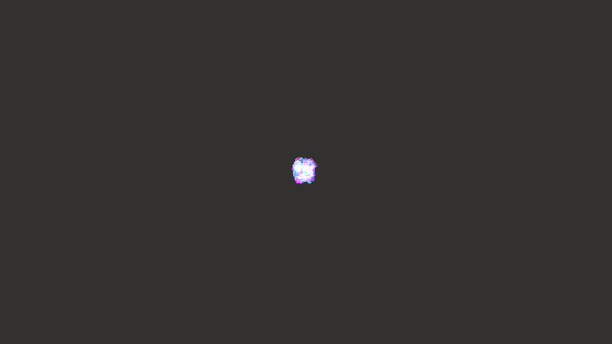

# generative_crystallography_fracture_3d

## Metadata
- **Date**: 2026-06-20
- **Theme**: An abstract 3D simulation of a growing crystal that suddenly fractures into hundreds of sharp shards
- **Technique**: 300 translucent box primitives are tightly clustered into a crystalline form. A time-based trigger induces a violent shaking effect followed by an explosive physics pass that scatters the shards outward with rotational momentum. Rendered with additive blending for a glowing, magical crystal aesthetic.
- **Logic Lab Reference**: 

## Concept
An abstract 3D simulation of a growing crystal that suddenly fractures into hundreds of sharp shards under intense pressure.

## Technical Details
- **Renderer**: Unknown
- **Simulation**: Unknown
- **Visuals**: Unknown
- **Animation**: Contains animation details
