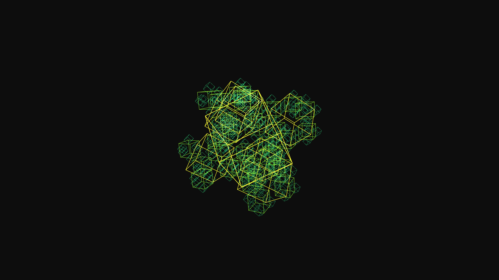

# generative_cyber_fractal_glitch_cube_3d

An animated 15s sequence of a generative 3D cybernetic fractal cube. The wireframe structures recursively subdivide and glitch in position and color, creating a dynamic optical illusion.

- **Theme**: A glowing hypercube that recursively subdivides into smaller data cubes, glitching with chromatic aberration and shifting its geometry to the beat of an invisible clock.
- **Technique**: 3D recursive boxes that rotate and scale down based on 3D noise and sine waves, with random glitches disrupting the position and colors using py5 blend modes.

