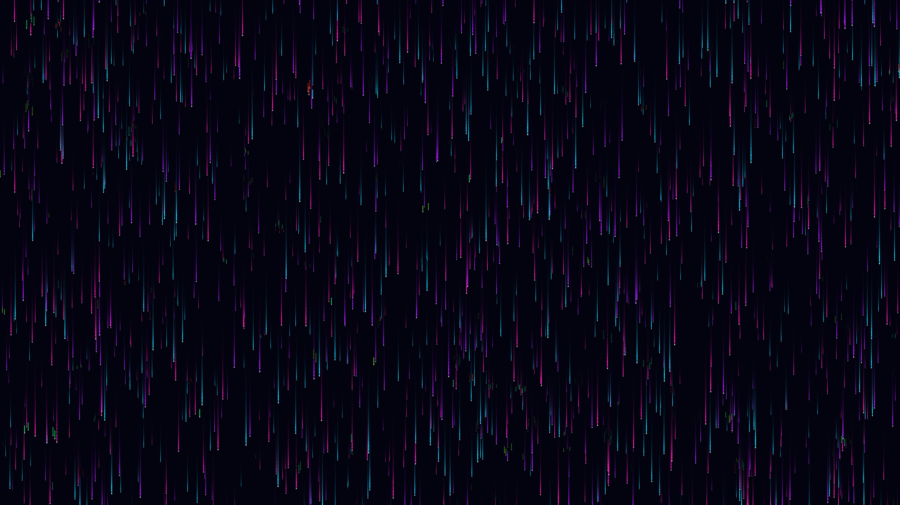

# generative_cyberpunk_neon_rain_matrix_2d

## Metadata
- **Date**: 2026-06-27
- **Theme**: Generative Art
- **Technique**: Uses thousands of independent dropping particles with simulated depth (z-index) determining their size, speed, and brightness. High-frequency OpenSimplex noise is sampled as the drops fall to trigger sudden horizontal glitch displacements and color inversions, adding a dynamic, corrupted digital feel. Rendered in a 2D context using semi-transparent background clearing for motion trails.
- **Logic Lab Reference**: 

## Concept
No concept description provided.

## Technical Details
- **Renderer**: Unknown
- **Simulation**: Unknown
- **Visuals**: Unknown
- **Animation**: Unknown
