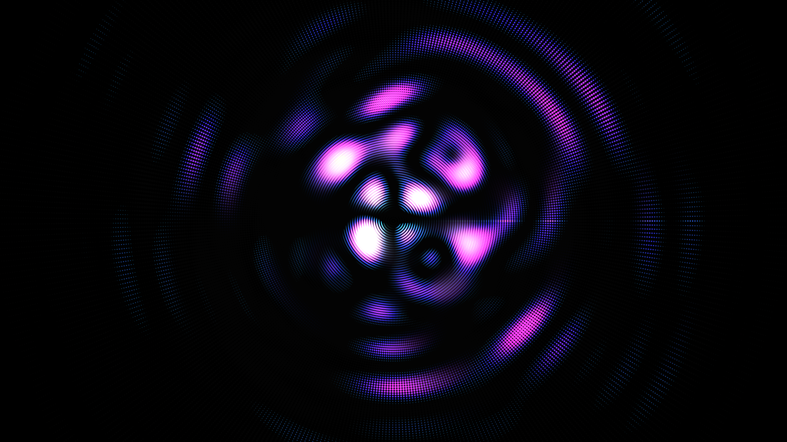

# generative_cymatic_frequency_mandala_2d

## Metadata
- **Date**: 2026-06-28
- **Theme**: A hypnotic, generative mandala inspired by cymatics—the visual representation of sound
- **Technique**: The sketch uses NumPy to efficiently evaluate wave interference equations across a dense radial grid (using a mesh grid of polar coordinates). It computes the distance from multiple rotating wave sources and calculates phase-shifted sine waves with exponential distance attenuation. Where the combined interference magnitude exceeds a specific threshold, luminous particles are rendered. Additive blending (`py5.ADD`) combined with a semi-transparent background clear produces a glowing, continuous motion blur effect that visualizes the "standing waves."
- **Logic Lab Reference**: 

## Concept
A hypnotic, generative mandala inspired by cymatics—the visual representation of sound. Multiple overlapping wave frequencies originate from dynamically rotating centers, interacting to create complex, standing-wave interference patterns. The result is a mesmerizing, blooming mandala that resembles resonant frequencies vibrating through a fluid medium or sand on a Chladni plate.

## Technical Details
- **Renderer**: Unknown
- **Simulation**: Unknown
- **Visuals**: Unknown
- **Animation**: Contains animation details
