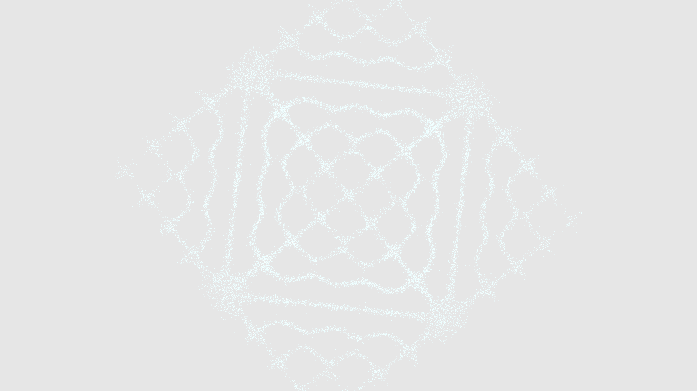

# generative_cymatics_chladni

## Metadata
- **Date**: 2026-05-23
- **Theme**: A real-time simulation of Cymatics—visualizing sound through 30,000 sand particles vibrating on a Ch
- **Technique**: Unknown
- **Logic Lab Reference**: 

## Concept
A real-time simulation of Cymatics—visualizing sound through 30,000 sand particles vibrating on a Chladni plate.

- **Date**: 2026-05-23
- **Theme**: Cymatics, Chladni figures, standing waves, physics simulation, sound visualization.
- **Technique**: Calculates the squared gradient of the classic Chladni equation (`a * sin(n*pi*x)*sin(m*pi*y) + b * sin(m*pi*x)*sin(n*pi*y)`). 30,000 simulated grains of sand are placed on a 2D plane. Every frame, they read the local gradient of the wave amplitude and accelerate "downhill" towards the zero-amplitude nodal lines where the plate isn't vibrating. NumPy array vectorization allows simulating 30,000 particles at 60 FPS in Python. As the resonant frequencies `n` and `m` morph smoothly over time, the complex geometric figures naturally dissolve and reform into new harmonic states. Brownian noise prevents particles from getting artificially stuck. 15s 60fps MP4.
- **Description**: In a dark, resonant void, 30,000 glowing particles of "digital sand" vibrate violently before suddenly settling into perfectly symmetrical, incredibly complex geometric patterns. As the hidden audio frequencies shift, the sand boils over, scattering into chaos, only to instantly lock into an entirely new, intricate mandala. The sand forms sharp grids, sweeping arcs, and nested loops, glowing with shifting neon hues as the virtual plate slowly rotates.

## Technical Details
- **Renderer**: Unknown
- **Simulation**: Unknown
- **Visuals**: Unknown
- **Animation**: Contains animation details
