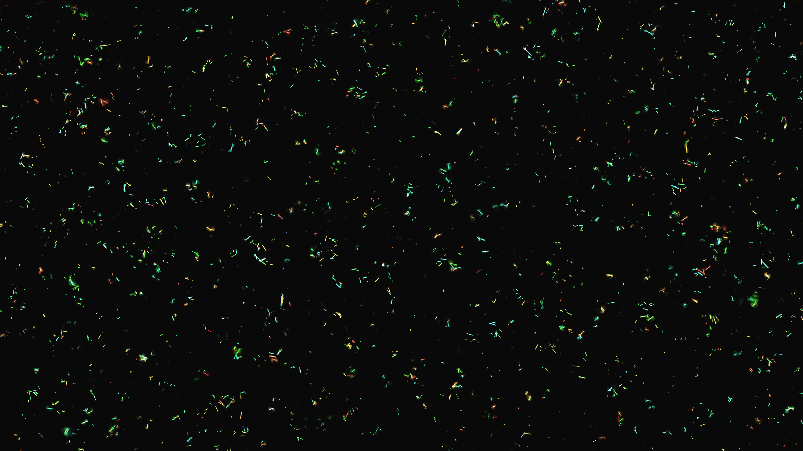

# generative_cytoskeleton_assembly_2d

## Metadata
- **Date**: 2026-06-20
- **Theme**: Visualizing the dynamic assembly and disassembly of a cellular cytoskeleton (microtubules and actin 
- **Technique**: A 2D simulation using 8000 short line segments (filaments) colored green (microtubules) and red (actin). The filaments align their angles to a multi-octave Perlin noise flow field and slowly drift. A secondary noise field modulates the `current_len` of each filament, simulating rapid polymerization and depolymerization as they move through different chemical gradients. Rendered with additive blending and a fading background to create fluid trails.
- **Logic Lab Reference**: 

## Concept
Visualizing the dynamic assembly and disassembly of a cellular cytoskeleton (microtubules and actin filaments) (inspired by GO:0007010).

## Technical Details
- **Renderer**: Unknown
- **Simulation**: Unknown
- **Visuals**: Unknown
- **Animation**: Contains animation details
