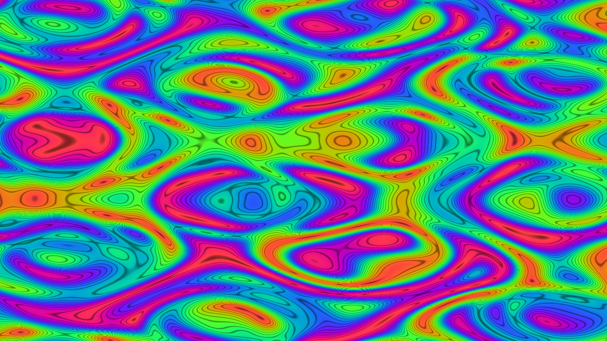

# generative_domain_warping_liquid_2d

## Metadata
- **Date**: 2026-06-28
- **Theme**: Nested noise equations (domain warping) where the mathematical grid coordinates are themselves conti
- **Technique**: Evaluating multi-octave 2D noise across an entire 4K grid pixel-by-pixel in Python would be extremely slow. To perfectly vectorize it, this sketch uses pure NumPy to evaluate layers of nested complex `sin()` and `cos()` wave interferences. This runs incredibly fast at half resolution (1920x1080), extracting beautiful organic contours mapped perfectly to a trigonometric ocean/pearl color palette, before upscaling.
- **Logic Lab Reference**: 

## Concept
Nested noise equations (domain warping) where the mathematical grid coordinates are themselves continuously displaced by noise functions. This creates a deeply organic, fluid-like marble liquid painting effect.

## Technical Details
- **Renderer**: Unknown
- **Simulation**: Unknown
- **Visuals**: Unknown
- **Animation**: Contains animation details
