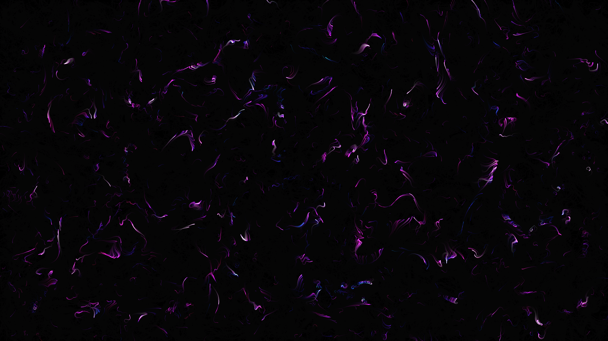

# generative_fbm_domain_warping_2d

## Metadata
- **Date**: 2026-06-25
- **Theme**: - **Theme**: Liquid neon currents shaped by layered fractal noise, representing an abstract topograp
- **Technique**: Unknown
- **Logic Lab Reference**: 

## Concept
- **Theme**: Liquid neon currents shaped by layered fractal noise, representing an abstract topographic map or magnetic fluid.
- **Technique**: Fractional Brownian Motion (fBM) domain warping applied to a dense particle system in 2D. Particles trace paths through a vector field defined by nested fBM functions. Additive blending makes the overlapping paths glow.
- **Palette**: High contrast neon cyber-palette (Cyan, Magenta, Gold) on a pitch-black background.

## Technical Details
- **Renderer**: Unknown
- **Simulation**: Unknown
- **Visuals**: Unknown
- **Animation**: Unknown
