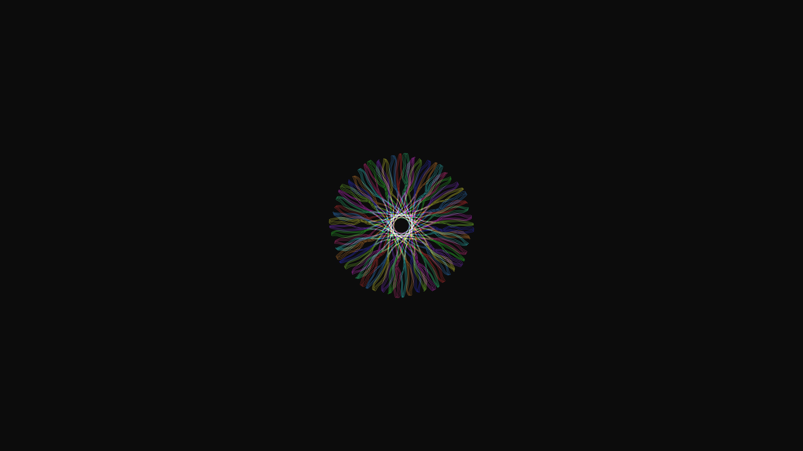

# generative_floral_spirograph_mandala_2d

## Metadata
- **Date**: 2026-06-14
- **Theme**: An animated 20s sequence of a blooming, intricate floral mandala composed of thousands of intersecti
- **Technique**: 2D parametric equations for a hypotrochoid and epitrochoid combined. A massive array of `py5.vertex` points is generated procedurally with slowly rotating phases to give a blooming effect, with Perlin noise added for subtle organic wobble.
- **Logic Lab Reference**: 

## Concept
An animated 20s sequence of a blooming, intricate floral mandala composed of thousands of intersecting spirograph lines.

## Technical Details
- **Renderer**: Unknown
- **Simulation**: Unknown
- **Visuals**: Unknown
- **Animation**: Unknown
