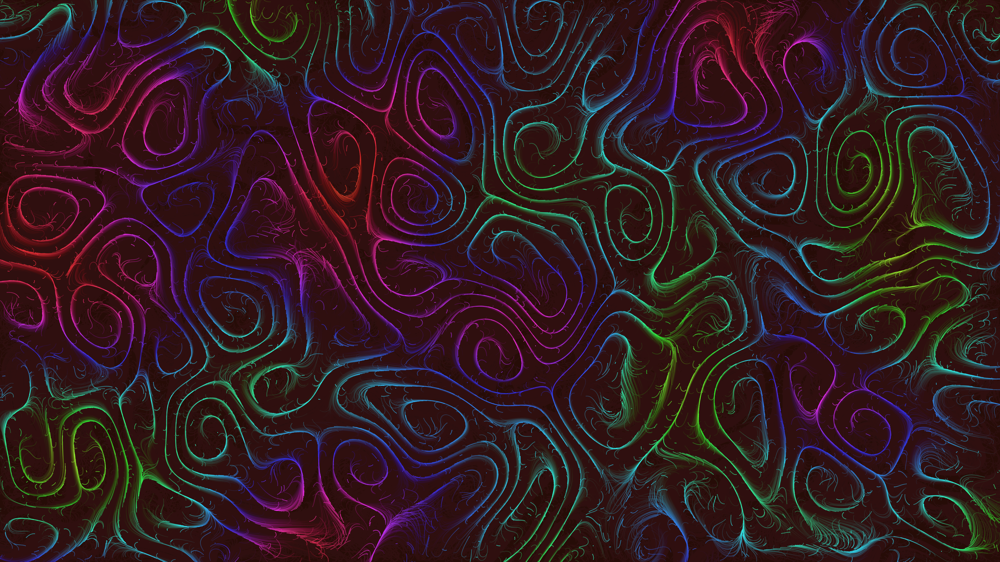

# generative_flow_field_topography_2d

## Metadata
- **Date**: 2026-06-27
- **Theme**: Generative Art
- **Technique**: Uses thousands of individual particles navigating through a time-varying OpenSimplex noise vector field. A semi-transparent background clearing technique is used to create smooth, lingering trails that fade over time.
- **Logic Lab Reference**: 

## Concept
No concept description provided.

## Technical Details
- **Renderer**: Unknown
- **Simulation**: Unknown
- **Visuals**: Unknown
- **Animation**: Unknown
