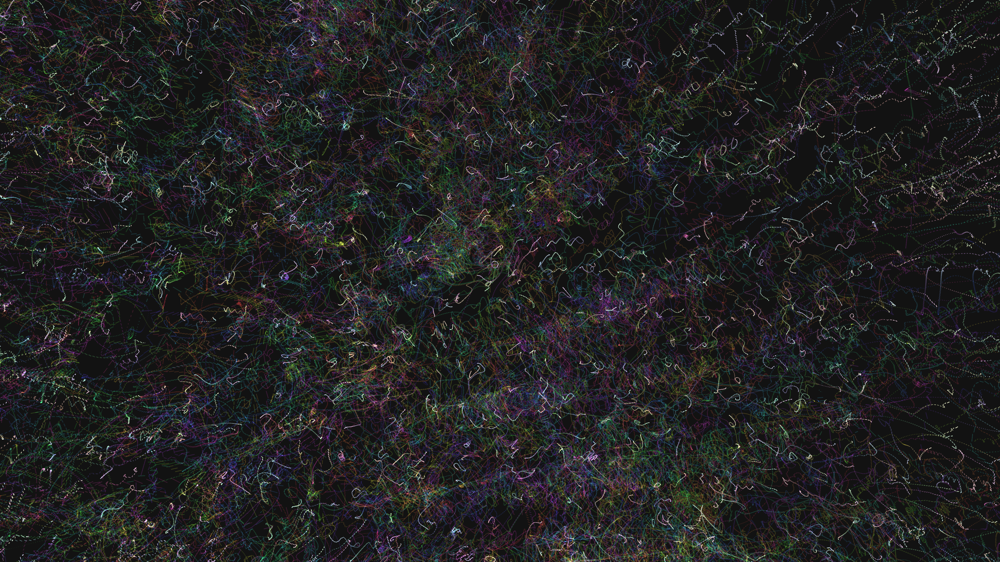

# generative_fluid_chromatic_vortices_3d

An animated 15s sequence of smooth, swirling vortices of color flowing into and out of each other in a 3D field, mimicking colorful fluid dynamics.

- **Theme**: Smooth, swirling vortices of color flowing into and out of each other in a 3D field, mimicking colorful fluid dynamics.
- **Technique**: Generates a 3D vector field based on perlin noise to direct thousands of colorful particles. The particles are drawn with low opacity using additive blending. When they move along the vector field, they naturally form swirling vortices.

