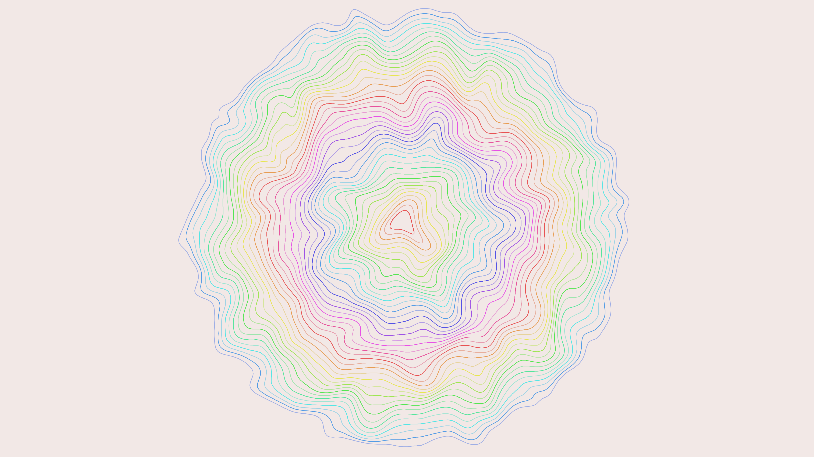

# generative_fluid_ink_marbling_2d

A simulation of Suminagashi (Japanese ink marbling). Multiple concentric rings of ink are placed on a virtual fluid surface and subjected to a continuous turbulent displacement field driven by Perlin curl noise. The rings stretch and fold into intricate marbled patterns.

## Technical Details

- **Language**: Python + py5
- **Format**: Animation (15s @ 60fps)
- **Renderer**: 2D

## Output

