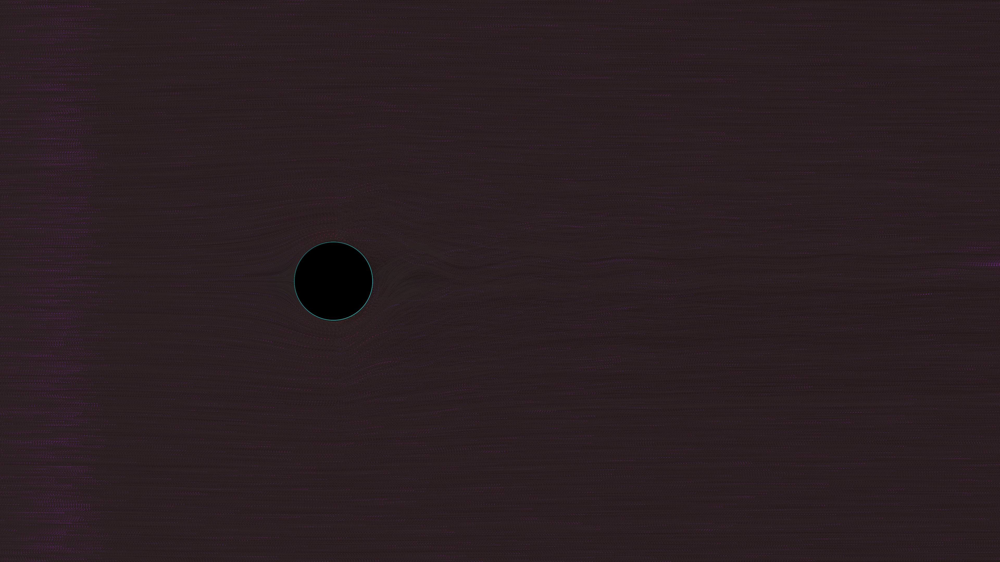

# generative_fluid_vortex_street_2d

An animated 2D visualization simulating a Kármán vortex street—the repeating pattern of swirling vortices caused by fluid flow separating around a cylindrical object. Thousands of glowing particles trace the flow, exhibiting turbulence modeled by potential flow equations perturbed by layered OpenSimplex noise. Additive blending creates intense luminescence in areas of high particle density.

## Technical Details

- **Language**: Python + py5
- **Format**: Animation (15s @ 60fps)
- **Renderer**: 2D

## Output

