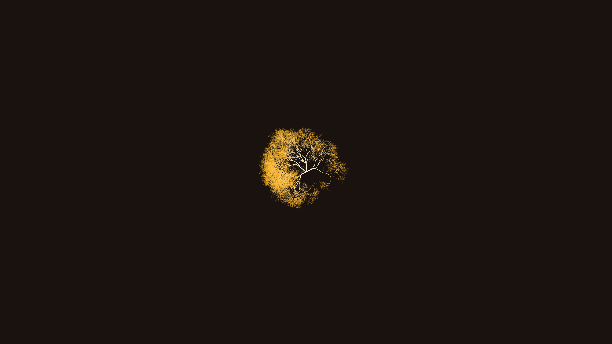

# generative_fractal_mycelium_network_2d

## Metadata
- **Date**: 2026-06-20
- **Theme**: An organic, branching mycelium network that grows across the screen, mimicking fungal hyphae explori
- **Technique**: A progressive branching algorithm (similar to L-systems but continuous) where active tips grow forward, wander slightly, and probabilistically split into multiple new branches. The canvas is not cleared each frame, allowing the network to permanently etch itself into the dark earthy background.
- **Logic Lab Reference**: 

## Concept
An organic, branching mycelium network that grows across the screen, mimicking fungal hyphae exploring for nutrients.

## Technical Details
- **Renderer**: Unknown
- **Simulation**: Unknown
- **Visuals**: Unknown
- **Animation**: Contains animation details
