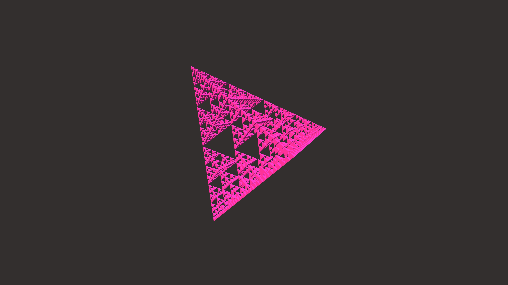

# generative_geometric_fractal_sierpinski_tetrahedron_3d

## Metadata
- **Date**: 2026-06-22
- **Theme**: An animated 15s sequence of a pulsing, rotating Sierpinski tetrahedron fractal in 3D
- **Technique**: Unknown
- **Logic Lab Reference**: 

## Concept
An animated 15s sequence of a pulsing, rotating Sierpinski tetrahedron fractal in 3D. The inner sections shift in color based on their depth in the recursion.

- **Theme**: A pulsing, rotating Sierpinski tetrahedron fractal in 3D. The inner sections shift in color based on their depth in the recursion.
- **Technique**: Draws a 3D tetrahedron recursively using `py5.push_matrix` and `py5.pop_matrix`. The entire fractal rotates in 3D space, and a sine wave oscillates the distance between recursive parts, creating an expanding and contracting "breathing" effect.

## Technical Details
- **Renderer**: Unknown
- **Simulation**: Unknown
- **Visuals**: Unknown
- **Animation**: Unknown
