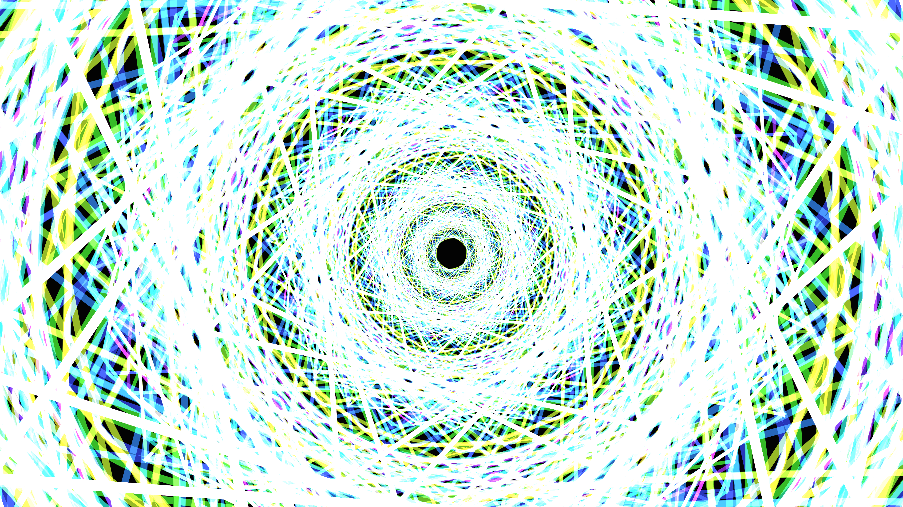

# generative_geometric_kaleidoscope_2d

An intricate, infinitely zooming geometric kaleidoscope.

## Details
- **Date**: 2026-06-21
- **Technique**: Polar coordinate mapping and recursive geometric shape rendering, producing an infinite zooming psychedelic illusion.
- **Format**: Animation (10s @ 60fps)
