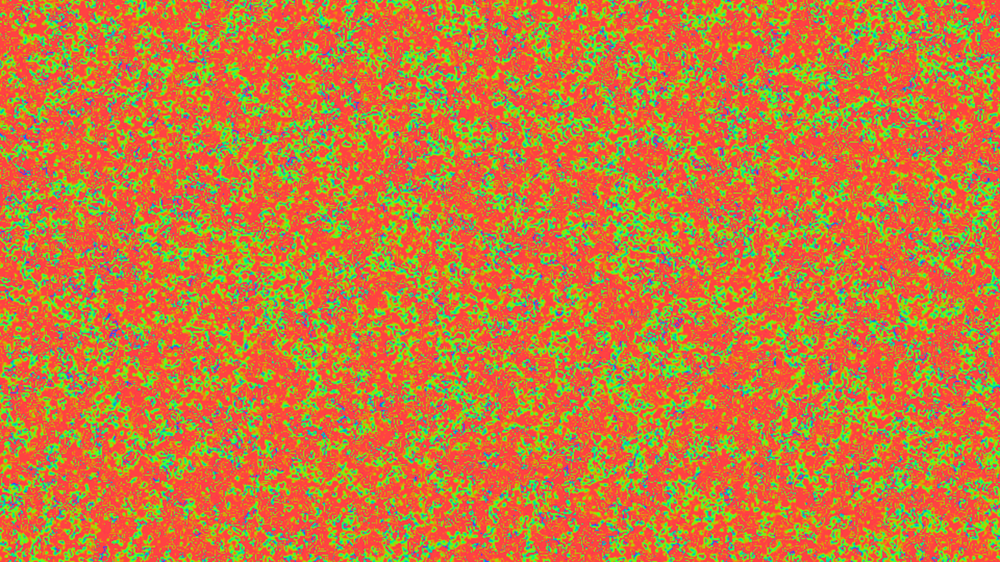

# generative_hodgepodge_machine_bz_reaction_2d

## Metadata
- **Date**: 2026-06-28
- **Theme**: A continuous digital cellular automata mimicking the Belousov-Zhabotinsky (BZ) chemical reaction
- **Technique**: Utilizes the "Hodgepodge Machine" cellular automaton model, operating across a grid with 100 possible infection/illness states. Because calculating an 8-neighbor sum and evaluating complex infection rules across hundreds of thousands of cells is incredibly slow in pure Python, it uses `np.roll()` across 8 directional axes to perfectly vectorize the entire 2D neighborhood calculation natively in NumPy's C backend. The grid states are then mapped through a continuous trigonometric cosine function to generate a seamless, beautiful fire/magma color gradient.
- **Logic Lab Reference**: 

## Concept
A continuous digital cellular automata mimicking the Belousov-Zhabotinsky (BZ) chemical reaction. The BZ reaction is famous for producing perfectly mesmerizing, self-organizing concentric spiral waves that expand outward like fluid interference patterns.

## Technical Details
- **Renderer**: Unknown
- **Simulation**: Unknown
- **Visuals**: Unknown
- **Animation**: Contains animation details
