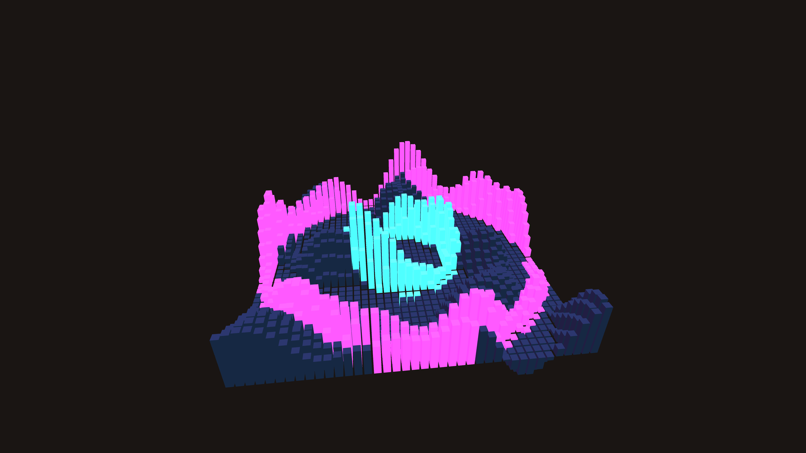

# generative_isometric_cityscape_pulse_3d

## Metadata
- **Date**: 2026-06-21
- **Theme**: An animated 15s sequence of an isometric view of a futuristic abstract city made of glowing blocks
- **Technique**: Unknown
- **Logic Lab Reference**: 

## Concept
An animated 15s sequence of an isometric view of a futuristic abstract city made of glowing blocks. The blocks pulse up and down based on a 2D noise field, simulating data traffic or energy flow across the grid.

- **Theme**: An isometric view of a futuristic abstract city made of glowing blocks. The blocks pulse up and down based on a 2D noise field, simulating data traffic or energy flow across the grid.
- **Technique**: Uses standard 3D rotation to simulate an isometric perspective. Renders a grid of 3D boxes. Modifies the height of each box based on a scrolling noise field and a radial distance sine wave to simulate sweeping energy pulses. Points with high energy emit a glowing neon hue.

## Technical Details
- **Renderer**: Unknown
- **Simulation**: Unknown
- **Visuals**: Unknown
- **Animation**: Unknown
