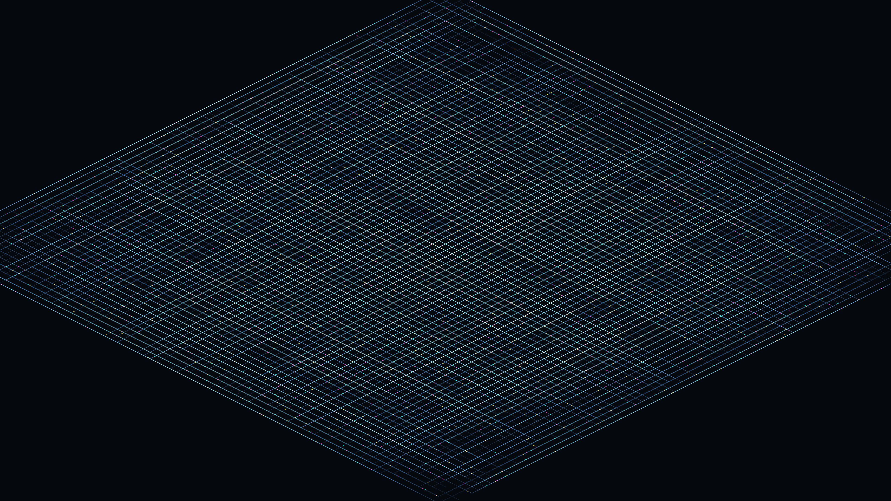

# generative_isometric_cyber_circuit_board_2d

## Metadata
- **Date**: 2026-06-28
- **Theme**: An isometric view of a massive, glowing futuristic motherboard where neon data packets race along co
- **Technique**: Procedurally generating a dense orthogonal grid of 1,500 trace paths, then simulating the continuous movement of 5,000 "data packets" along these paths by mapping time onto segment ratios. The entire 2D scene is then mapped through an isometric 3D projection matrix (using 2D scale and rotate) which dynamically wobbles to give a sense of depth and scale.
- **Logic Lab Reference**: 

## Concept
An isometric view of a massive, glowing futuristic motherboard where neon data packets race along complex orthogonal traces.

## Technical Details
- **Renderer**: Unknown
- **Simulation**: Unknown
- **Visuals**: Unknown
- **Animation**: Contains animation details
