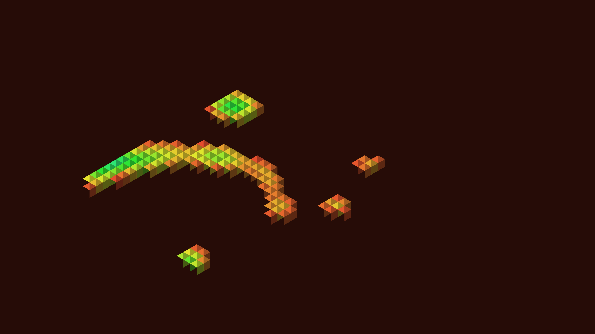

# generative_isometric_labyrinth_2d

## Metadata
- **Date**: 2026-06-27
- **Theme**: Generative Art
- **Technique**: Uses standard 2D vector drawing to simulate a 3D isometric projection, completely bypassing OpenGL/P3D engine. Sorts blocks back-to-front based on grid iteration. Color and column height are driven by OpenSimplex noise parameterized by time.
- **Logic Lab Reference**: 

## Concept
No concept description provided.

## Technical Details
- **Renderer**: P3D
- **Simulation**: Unknown
- **Visuals**: Unknown
- **Animation**: Unknown
