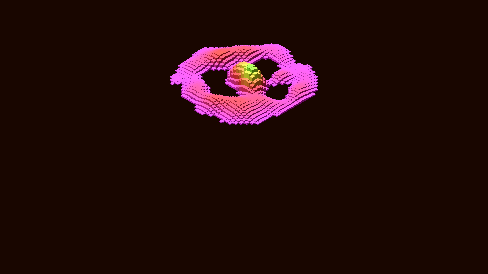

# generative_isometric_voxel_landscape_2d

## Metadata
- **Date**: 2026-06-26
- **Theme**: - **Date**: 2026-06-25 - **Theme**: A stylized, retro-futuristic voxel landscape drawn using 2D isom
- **Technique**: Unknown
- **Logic Lab Reference**: 

## Concept
- **Date**: 2026-06-25
- **Theme**: A stylized, retro-futuristic voxel landscape drawn using 2D isometric projection. It features glowing towers that pulse to a simulated audio beat.
- **Technique**: Custom 2D isometric projection maps a 40x40 grid onto the screen. Each cell in the grid is drawn as a 3D-looking cube composed of three colored polygons (top, left, right faces). The height of each voxel is determined by a combination of OpenSimplex noise and a radial sine wave pulse that animates over time.
- **Description**: An animated sequence of a generative isometric voxel landscape.

## Technical Details
- **Renderer**: Unknown
- **Simulation**: Unknown
- **Visuals**: Unknown
- **Animation**: Unknown
