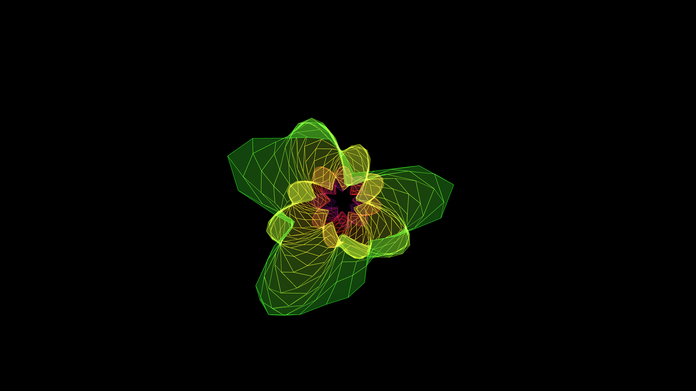

# generative_kaleidoscopic_glass_tunnel

## Metadata
- **Date**: 2026-05-24
- **Theme**: - **Format**: Animation (15s @ 60fps) - **Theme**: Falling infinitely through a shifting, glowing st
- **Technique**: Unknown
- **Logic Lab Reference**: 

## Concept
- **Format**: Animation (15s @ 60fps)
- **Theme**: Falling infinitely through a shifting, glowing stained-glass tunnel where the geometry recursively folds into itself.
- **Technique**: Uses a rolling buffer of Z-coordinates to create the illusion of an infinitely moving 3D tunnel. The tunnel is constructed using 60 polygonal rings connected by `QUAD_STRIP` meshes. Instead of static shapes, the radius and twist of each ring are continually warped by complex, interfering sine wave functions, giving the tunnel an organic, breathing quality. Additive blending combined with dynamic opacity creates a radiant, translucent glass effect that fades naturally into the dark void.

## Technical Details
- **Renderer**: Unknown
- **Simulation**: Unknown
- **Visuals**: Unknown
- **Animation**: Contains animation details
