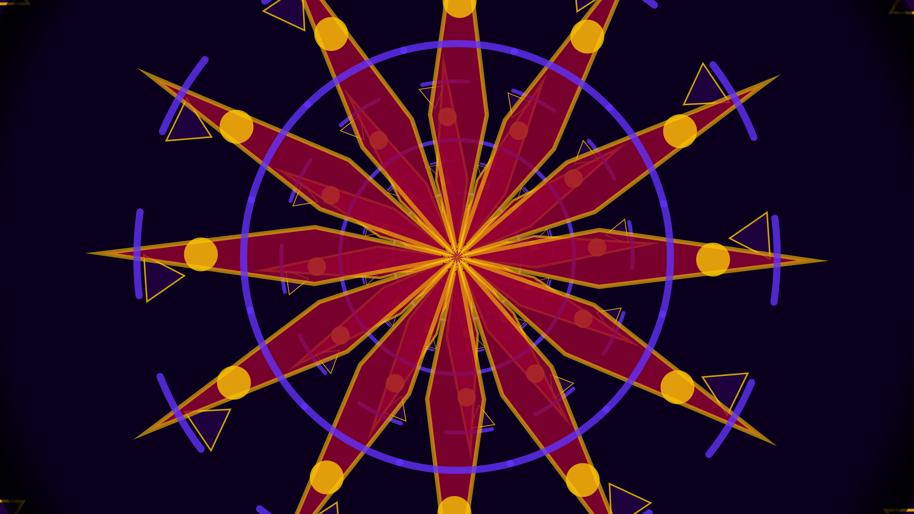

# generative_kaleidoscopic_mandala_zoom_2d

## Metadata
- **Date**: 2026-06-14
- **Theme**: An animated 15s sequence showing a mesmerizing, jewel-toned mandala rotating and zooming endlessly t
- **Technique**: Symmetrical rotational drawing (12-fold symmetry) combined with a modulo-based infinite zoom scaling trick. Complex nested geometric primitives (polygons, arcs, sweeping lines) are drawn in a single wedge and then rotated and mirrored to form the mandala. The entire structure smoothly rotates and expands.
- **Logic Lab Reference**: 

## Concept
An animated 15s sequence showing a mesmerizing, jewel-toned mandala rotating and zooming endlessly towards the viewer.

## Technical Details
- **Renderer**: Unknown
- **Simulation**: Unknown
- **Visuals**: Unknown
- **Animation**: Unknown
