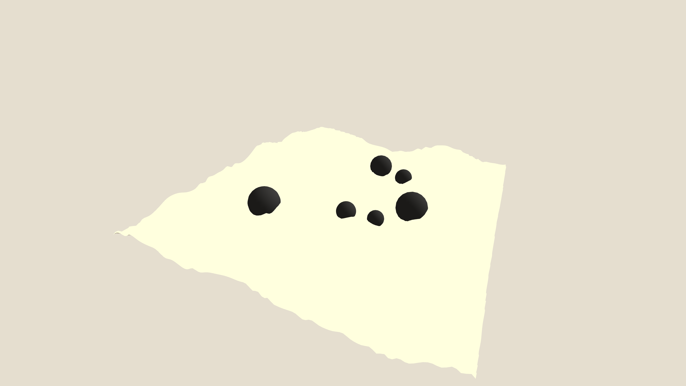

# generative_karesansui_zen_garden_3d

## Metadata
- **Date**: 2026-06-09
- **Theme**: - **Date**: 2026-06-08 - **Theme**: A minimalist, contemplative Japanese rock garden where the sand 
- **Technique**: Unknown
- **Logic Lab Reference**: 

## Concept
- **Date**: 2026-06-08
- **Theme**: A minimalist, contemplative Japanese rock garden where the sand ripples are procedurally drawn as sweeping, concentric topographic lines that flow around stark, dark geometric "stones".
- **Technique**: A 3D plane that is slightly tilted. The sand lines are generated by computing distances to a set of fixed spheres (stones) mixed with OpenSimplex noise. The distance function is fed into a sine wave to create sharp, flowing ridges. The scene uses a slow, smooth camera pan with deep, contemplative purple/indigo coloring.
- **Description**: An animated 15s simulation of a contemplative generative Zen sand garden with obsidian stones.

## Technical Details
- **Renderer**: Unknown
- **Simulation**: Unknown
- **Visuals**: Unknown
- **Animation**: Contains animation details
