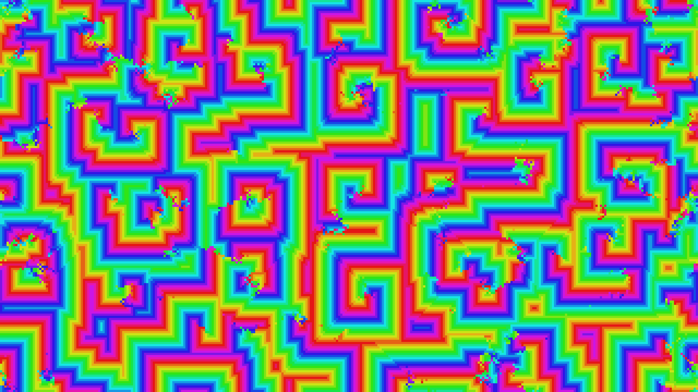

# generative_kinetic_cellular_automata_2d

## Metadata
- **Date**: 2026-06-25
- **Theme**: - **Theme**: A continuous 2D cellular automata generating hypnotic, propagating wave patterns remini
- **Technique**: Unknown
- **Logic Lab Reference**: 

## Concept
- **Theme**: A continuous 2D cellular automata generating hypnotic, propagating wave patterns reminiscent of chemical oscillations or biological growth.
- **Technique**: Cyclic Cellular Automata on a 2D grid. Cells sequentially adopt the state of their neighbors if the neighbor is exactly one state ahead. Evaluated rapidly using vectorized NumPy operations and rendered as dense quads in Py5.
- **Palette**: A full psychedelic spectrum where grid states map to hues that continuously shift over time.

## Technical Details
- **Renderer**: Unknown
- **Simulation**: Unknown
- **Visuals**: Unknown
- **Animation**: Unknown
