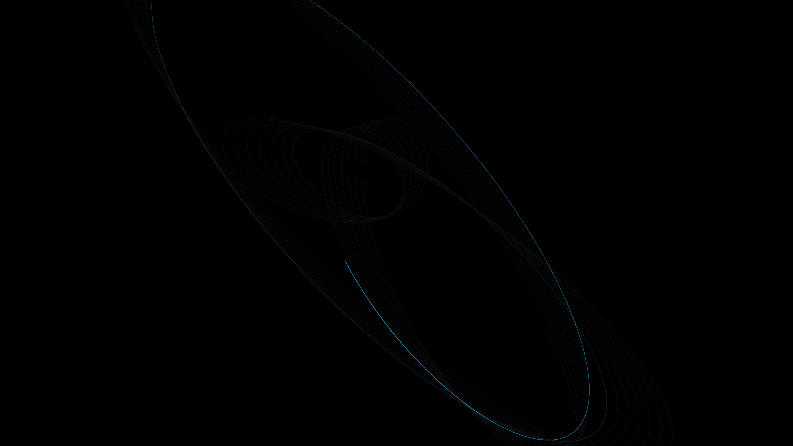

# generative_kinetic_harmonograph_pendulum_2d

## Metadata
- **Date**: 2026-06-25
- **Theme**: - **Theme**: A simulation of a complex mechanical harmonograph with multiple coupled pendulums drawi
- **Technique**: Unknown
- **Logic Lab Reference**: 

## Concept
- **Theme**: A simulation of a complex mechanical harmonograph with multiple coupled pendulums drawing a continuous overlapping curve.
- **Technique**: Parametric equations mapping multiple sine waves with decaying amplitude and slightly detuned frequencies, leaving a smoothly rendered fading trail over 15 seconds.
- **Palette**: Rich ruby transitioning to glowing gold on a dark velvet background, rendered with additive blending.

## Technical Details
- **Renderer**: Unknown
- **Simulation**: Unknown
- **Visuals**: Unknown
- **Animation**: Unknown
