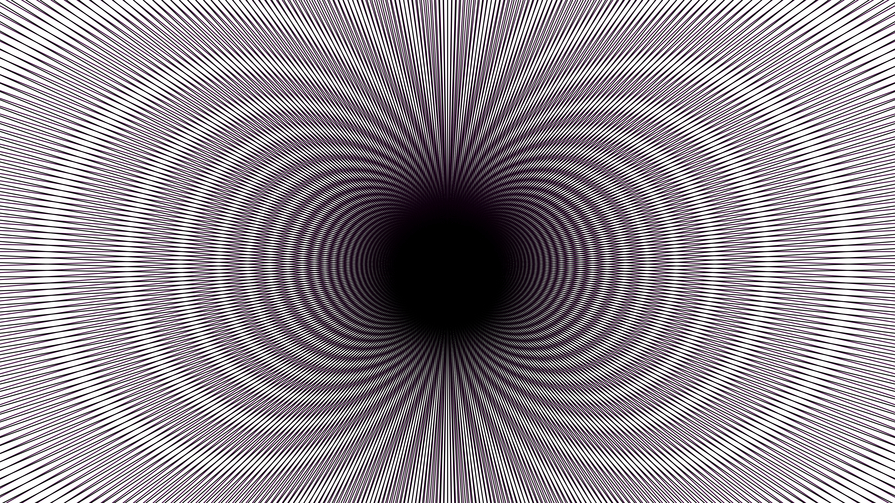

# generative_kinetic_moire_interference_2d

## Metadata
- **Date**: 2026-06-28
- **Theme**: A kinetic optical illusion utilizing overlapping dense geometric grids of radiating lines to create 
- **Technique**: Two identical sets of 400 radiating lines are generated perfectly on top of each other. The bottom layer is static (though slowly cycling through a neon RGB color phase), while the top layer is drawn in high-contrast black and mathematically translated and rotated over time. This continuous transformation causes the geometric interference pattern to rapidly ripple and shift, creating false curves and motion.
- **Logic Lab Reference**: 

## Concept
A kinetic optical illusion utilizing overlapping dense geometric grids of radiating lines to create a mind-bending Moiré interference pattern.

## Technical Details
- **Renderer**: Unknown
- **Simulation**: Unknown
- **Visuals**: Unknown
- **Animation**: Contains animation details
