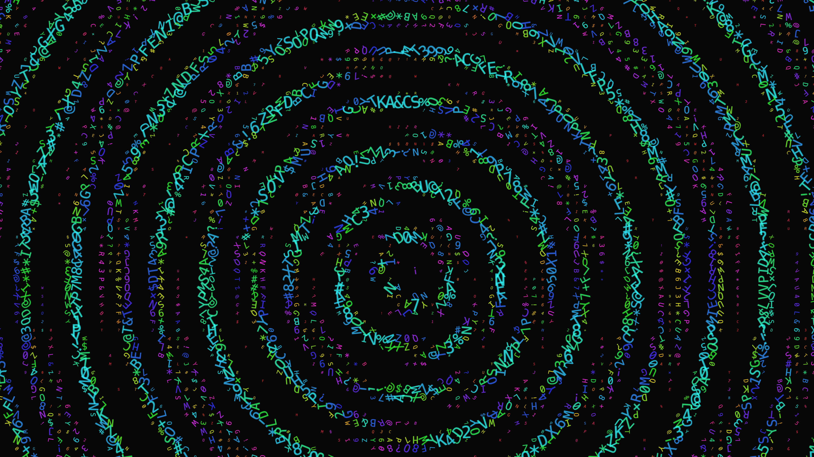

# generative_kinetic_typography_pulse_2d

## Metadata
- **Date**: 2026-06-20
- **Theme**: An intense, pulsing grid of kinetic typography where fragmented data streams assemble and dissolve r
- **Technique**: Utilizing a grid of characters drawn with a Courier monospace font. The scale, rotation, and character itself shift based on an underlying multi-layered interference distance field from two orbiting pulse centers. Only regions where the interference wave is positive are rendered, creating a moving mask of characters.
- **Logic Lab Reference**: 

## Concept
An intense, pulsing grid of kinetic typography where fragmented data streams assemble and dissolve rhythmically.

## Technical Details
- **Renderer**: Unknown
- **Simulation**: Unknown
- **Visuals**: Unknown
- **Animation**: Contains animation details
