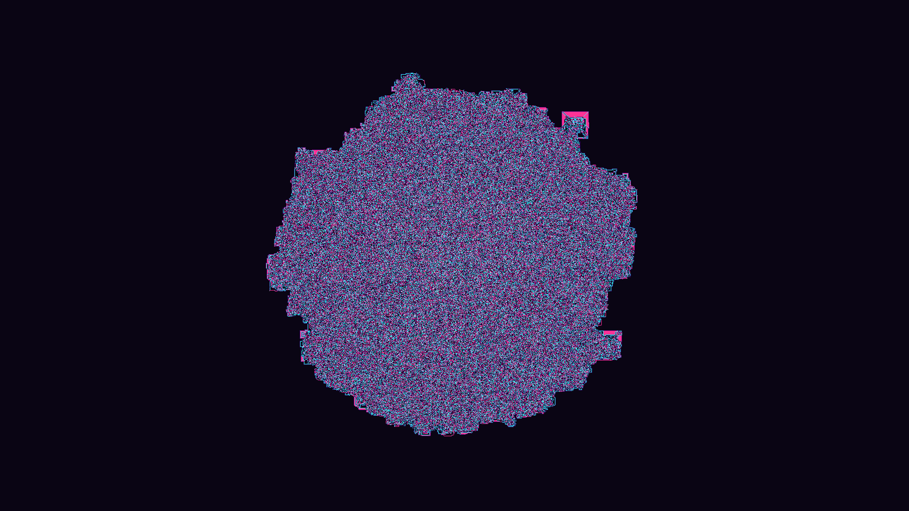

# generative_langtons_ant_colony_2d

## Metadata
- **Date**: 2026-06-28
- **Theme**: Thousands of generalized Langton's Ants moving simultaneously on a massive grid, creating chaotic di
- **Technique**: Since running a simple loop for 5,000 ants 150 times per frame is quite slow in Python, NumPy advanced indexing is utilized to update the entire colony perfectly in parallel. The grid runs at half resolution (1920x1080) and uses nearest-neighbor upscaling when writing via `py5.image()` to give the tapestries a sharp, crisp pixel-art aesthetic. The colony operates on a 4-state generalized Langton rule (L-R-R-L).
- **Logic Lab Reference**: 

## Concept
Thousands of generalized Langton's Ants moving simultaneously on a massive grid, creating chaotic digital noise that eventually collapses into intricate, emergent geometric "highways".

## Technical Details
- **Renderer**: Unknown
- **Simulation**: Unknown
- **Visuals**: Unknown
- **Animation**: Contains animation details
