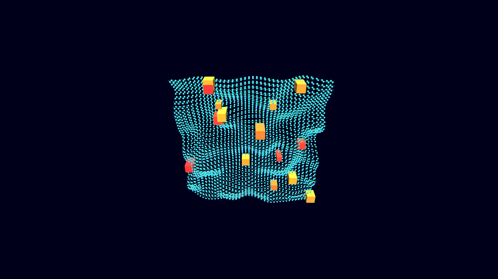

# generative_lipid_bilayer_fluidity_3d

## Metadata
- **Date**: 2026-06-20
- **Theme**: Visualizing the fluid mosaic model of a cell membrane, showing lipid molecules undulating in a bilay
- **Technique**: A 40x40 3D grid of instanced dual-sphere structures representing the hydrophilic heads and hydrophobic tails of a lipid bilayer. The entire grid undulates smoothly using 2D looping Perlin noise. The tails of the lipids wiggle based on the noise field, and occasional large red/orange blocks representing transmembrane proteins drift along with the surface. Rendered with directional lighting to give physical depth to the organic cellular structure.
- **Logic Lab Reference**: 

## Concept
Visualizing the fluid mosaic model of a cell membrane, showing lipid molecules undulating in a bilayer (inspired by GO:0016020 - membrane).

## Technical Details
- **Renderer**: Unknown
- **Simulation**: Unknown
- **Visuals**: Unknown
- **Animation**: Contains animation details
