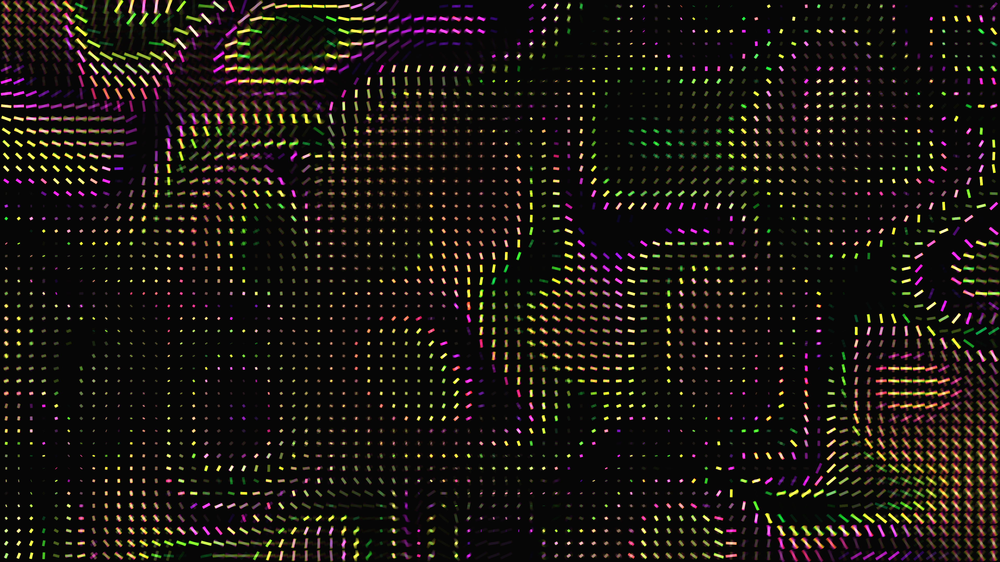

# generative_liquid_crystal_birefringence_2d

## Metadata
- **Date**: 2026-06-24
- **Theme**: - **Date**: 2026-06-24 - **Theme**: A simulation of 2D liquid crystal birefringence
- **Technique**: Unknown
- **Logic Lab Reference**: 

## Concept
- **Date**: 2026-06-24
- **Theme**: A simulation of 2D liquid crystal birefringence. Smooth volumetric waves of polarized light that refract dynamically, creating iridescent, rainbow-colored interference patterns as the structure shifts in a virtual magnetic field.
- **Technique**: A 2D grid simulation mapping polarized liquid crystals. The phase shift and interference are calculated using overlapping 2D OpenSimplex noise fields. Rectangles are rotated and scaled based on the noise field to visualize the twisting molecules, while the hue and brightness are mapped to the interference pattern, simulating polarized light iridescence with additive blending.
- **Description**: An animated sequence of a generative 2D liquid crystal birefringence simulation.

## Technical Details
- **Renderer**: Unknown
- **Simulation**: Unknown
- **Visuals**: Unknown
- **Animation**: Unknown
