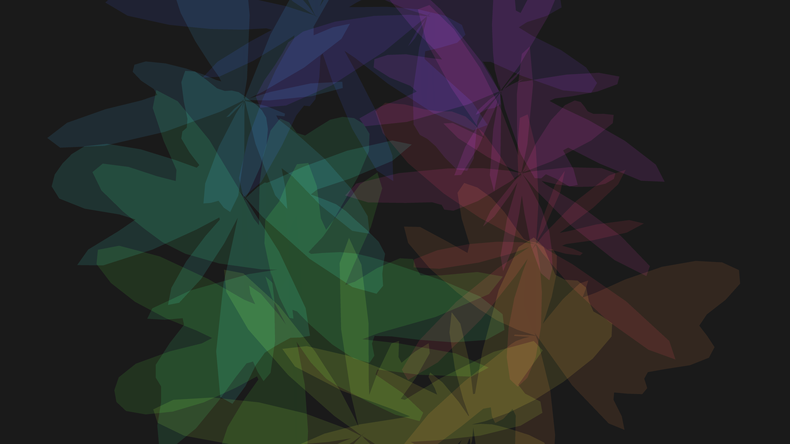

# generative_liquid_crystal_interference_2d

An animated 15s sequence of a generative 2D simulation of liquid crystal interference patterns. Organic, mathematically defined ripples blend polarized light to mimic cellular noise and wave interference.

- **Theme**: A 2D simulation of liquid crystal interference patterns, blending polarized light through organic, mathematically defined ripples that mimic cellular noise and wave interference.
- **Technique**: A high-density 2D grid where pixel colors are calculated using multiple interacting py5.os_noise values offset by sine/cosine waves based on time to simulate phase shifts in polarized light.

