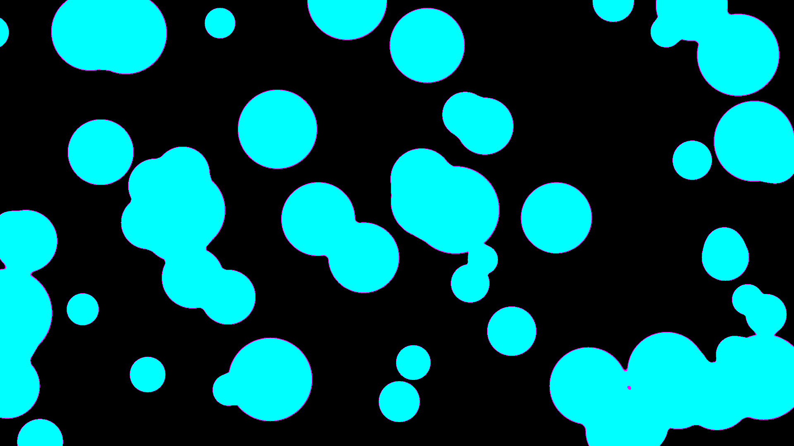

# generative_liquid_metaballs_threshold

## Metadata
- **Date**: 2026-05-24
- **Theme**: A simulated liquid metal physics visualization using additive blending and dynamic NumPy pixel thres
- **Technique**: Unknown
- **Logic Lab Reference**: 

## Concept
A simulated liquid metal physics visualization using additive blending and dynamic NumPy pixel thresholding.

- **Date**: 2026-05-23
- **Theme**: Metaballs, surface tension, fluid dynamics, liquid metal, organic blobs.
- **Technique**: Demonstrates an optimized way to render 2D Metaballs without expensive per-pixel distance field calculations. First, 60 invisible points bouncing around the screen are rendered as soft, grayscale radial gradients using `py5.blend_mode(py5.ADD)`. This creates a smooth, continuous scalar density field. Then, `py5.load_np_pixels()` intercepts the raw frame buffer. NumPy array masking is applied to threshold the image instantly: pixels above a certain brightness become a solid neon cyan (the liquid core), while pixels sitting exactly on the brightness threshold become neon magenta (surface tension / outlines). The result is perfectly smooth, gloopy liquid blobs that merge and separate dynamically. 15s 60fps MP4.
- **Description**: Drops of glowing neon cyan liquid float across a pitch-black canvas. As the droplets collide, they do not overlap like solid objects; instead, their surface tension snaps them together, seamlessly merging into massive, undulating blobs of liquid light. Each globule is outlined by a razor-sharp, glowing magenta edge that continuously recalculates its shape as the fluid stretches and tears apart, creating a hypnotic lava-lamp effect of digital plasma.

## Technical Details
- **Renderer**: Unknown
- **Simulation**: Unknown
- **Visuals**: Unknown
- **Animation**: Contains animation details
