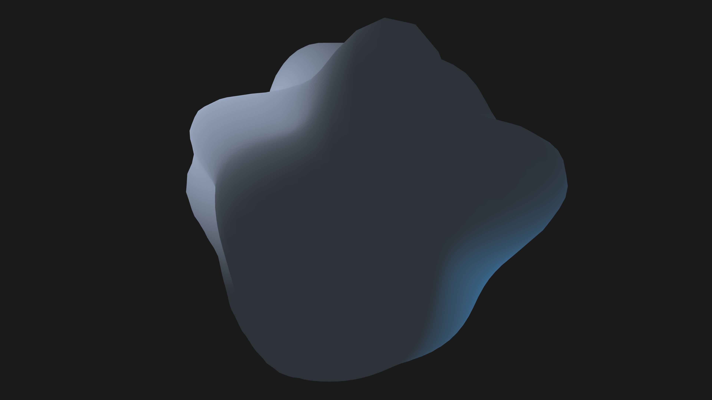

# generative_liquid_metal_displacement_3d

An animated 15s sequence of a 3D generative simulation of a reflective, viscous surface of liquid metal that constantly morphs and forms ripples, spikes, and waves in response to invisible forces.

- **Theme**: A reflective, viscous surface of liquid metal that constantly morphs and forms ripples, spikes, and waves in response to invisible forces.
- **Technique**: A high-density 3D sphere mesh where vertex normals are pushed out by 3D Perlin noise to create shifting liquid spikes and craters. Metallic shaders with a directional light and ambient light give the specular reflections of molten metal.

