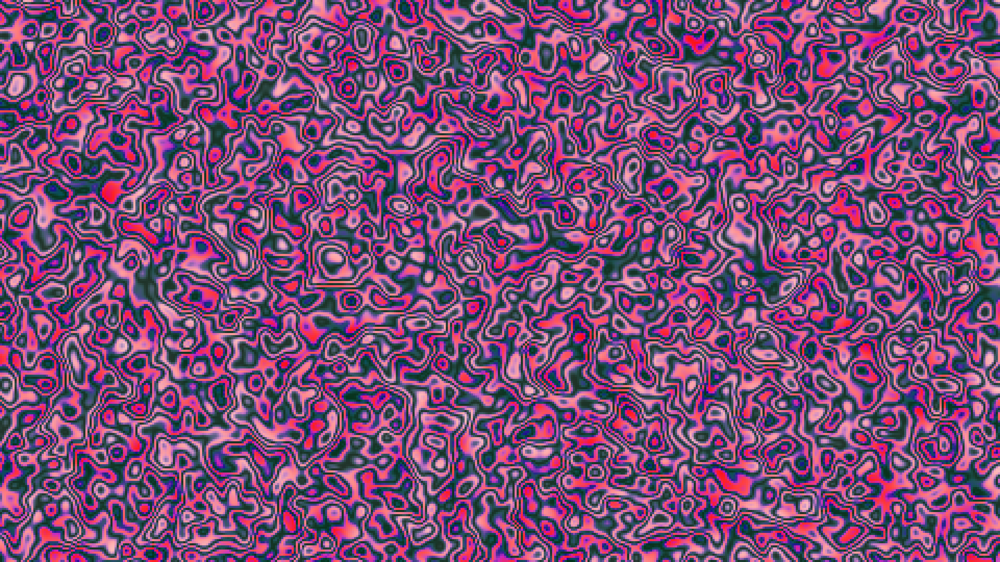

# generative_liquid_metal_interference_2d

## Metadata
- **Date**: 2026-06-20
- **Theme**: Simulating the psychedelic interference patterns of light reflecting off liquid metal or an oil slic
- **Technique**: Utilizing `py5.os_noise` with high octaves and frequency mapped directly to hue and brightness across a dense grid of rectangles. A sine wave function is wrapped around the noise values to create sharp interference banding typical of thin-film iridescence.
- **Logic Lab Reference**: 

## Concept
Simulating the psychedelic interference patterns of light reflecting off liquid metal or an oil slick.

## Technical Details
- **Renderer**: Unknown
- **Simulation**: Unknown
- **Visuals**: Unknown
- **Animation**: Contains animation details
