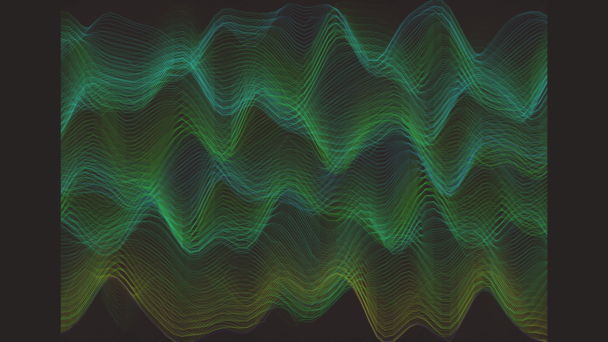

# generative_liquid_neon_glitch_topography_2d

## Metadata
- **Date**: 2026-06-24
- **Theme**: A 2D topographical landscape made of liquid neon that glitches out, with sharp geometric displacemen
- **Technique**: A grid of lines drawn as 2D noise topography. Over time, the noise field shifts to simulate flowing liquid. At random intervals, specific vertices experience sharp displacement spikes mimicking digital glitching. The color hue shifts based on height and time, generating a dynamic liquid neon aesthetic.
- **Logic Lab Reference**: 

## Concept
A 2D topographical landscape made of liquid neon that glitches out, with sharp geometric displacement simulating digital corruption flowing across organic waves. It visualizes data corruption as a moving landscape.

## Technical Details
- **Renderer**: Unknown
- **Simulation**: Unknown
- **Visuals**: Unknown
- **Animation**: Unknown
