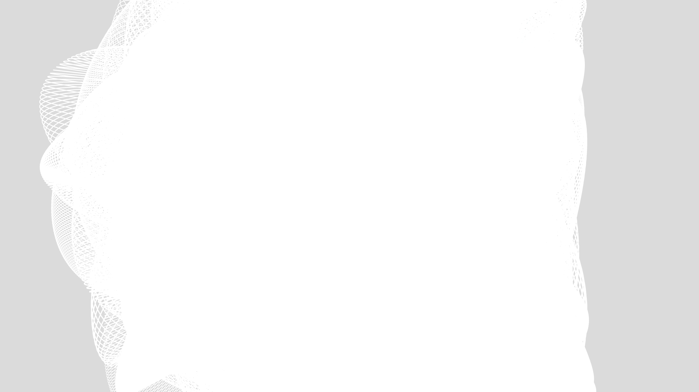

# generative_lissajous_knot_orbitals_3d

## Metadata
- **Date**: 2026-06-18
- **Theme**: A 3D animation of complex, intertwined Lissajous knots tracing orbital paths that glow with intense 
- **Technique**: Using parametric equations for 3D Lissajous curves to draw continuous, looping paths through space. Multiple paths are drawn with different phase shifts and thickness. A motion blur effect allows the scene to slowly fade, while the parametric constants slowly modulate over time, causing the glowing neon knots to writhe and evolve organically.
- **Logic Lab Reference**: 

## Concept
A 3D animation of complex, intertwined Lissajous knots tracing orbital paths that glow with intense neon light.

## Technical Details
- **Renderer**: Unknown
- **Simulation**: Unknown
- **Visuals**: Unknown
- **Animation**: Unknown
