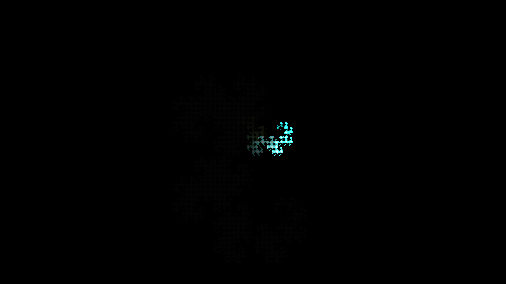

# generative_lsystem_space_filling_curve_2d

## Metadata
- **Date**: 2026-06-25
- **Theme**: - **Theme**: A space-filling curve (the Dragon curve) that incrementally draws itself, leaving a glo
- **Technique**: Unknown
- **Logic Lab Reference**: 

## Concept
- **Theme**: A space-filling curve (the Dragon curve) that incrementally draws itself, leaving a glowing trail that fades over time to reveal the complex geometry of the fractal.
- **Technique**: A parameterized L-System expanded in Python into 14 iterations, producing thousands of drawing instructions. The line segments are then drawn incrementally over time in Py5 using scaled translations and additive blending.
- **Palette**: Bright emerald and sapphire on a pitch-black background, cycling rapidly as the path draws.

## Technical Details
- **Renderer**: Unknown
- **Simulation**: Unknown
- **Visuals**: Unknown
- **Animation**: Unknown
