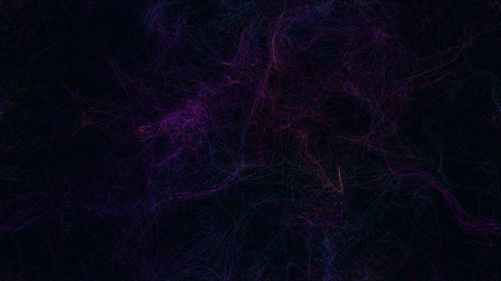

# generative_luminous_noise_ribbons_2d

## Metadata
- **Date**: 2026-06-28
- **Theme**: Generative Art
- **Technique**: Unknown
- **Logic Lab Reference**: 

## Concept
No concept description provided.

## Technical Details
- **Renderer**: Unknown
- **Simulation**: Unknown
- **Visuals**: Unknown
- **Animation**: - **Resolution**: 1920x1080 - **Framerate**: 60 FPS - **Format**: MP4 (H.264, yuv420p) - **Duration**: 15 seconds
