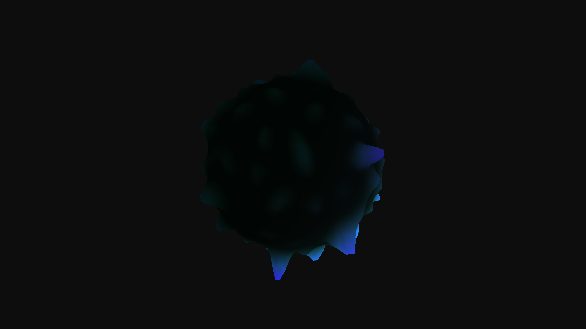

# generative_magnetic_ferrofluid_spikes_3d

An animated 15s sequence of a generative 3D magnetic ferrofluid. The vertices of a sphere are displaced using 3D Perlin noise to simulate intricate magnetic field spikes, reacting dynamically over time.

- **Theme**: A 3D simulation of magnetic ferrofluid reacting to dynamic magnetic fields, forming intricate, glossy black spikes that pulse and shift.
- **Technique**: 3D sphere with displaced vertices based on high-contrast 3D noise simulating magnetic field spikes, rendered with high specularity and neon under-glow.

