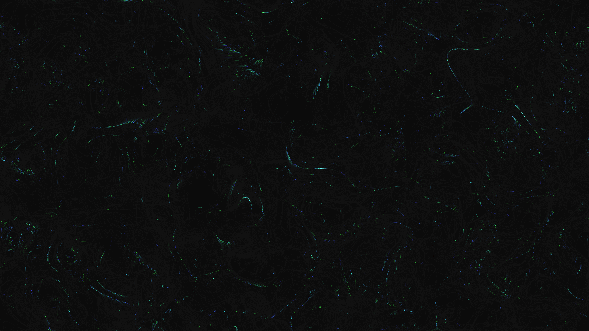

# generative_magnetic_field_lines_2d

An animated 15s sequence of a generative 2D simulation of intense magnetic fields. Thousands of particles flow along dynamic, invisible force lines that shift over time, creating sweeping glowing paths.

- **Theme**: A visualization of intense magnetic fields where thousands of particles flow along dynamic, invisible force lines that shift over time, creating sweeping glowing paths.
- **Technique**: A 2D vector field based on Perlin noise where the angle of the field changes gradually. Thousands of particles trace the field, leaving semi-transparent trails behind them to visualize the flow. Additive blending with neon colors.

