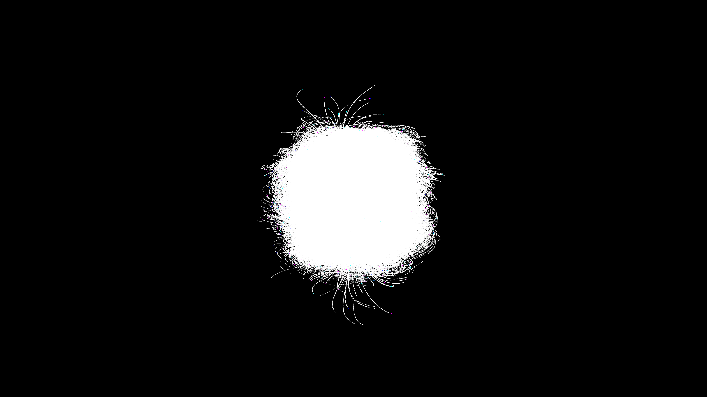

# generative_magnetic_field_lines_3d

## Metadata
- **Date**: 2026-06-20
- **Theme**: 3D visualization of magnetic field lines connecting two oscillating magnetic poles, with glowing par
- **Technique**: A mathematical dipole magnetic field simulation. Particles trace the field lines using the vector equation of a dipole field. Additive blending and trails emphasize the flow of the magnetic force. The two poles oscillate back and forth, driving the entire structure into a pulsating, breathing motion.
- **Logic Lab Reference**: 

## Concept
3D visualization of magnetic field lines connecting two oscillating magnetic poles, with glowing particles racing along the field lines.

## Technical Details
- **Renderer**: Unknown
- **Simulation**: Unknown
- **Visuals**: Unknown
- **Animation**: Contains animation details
