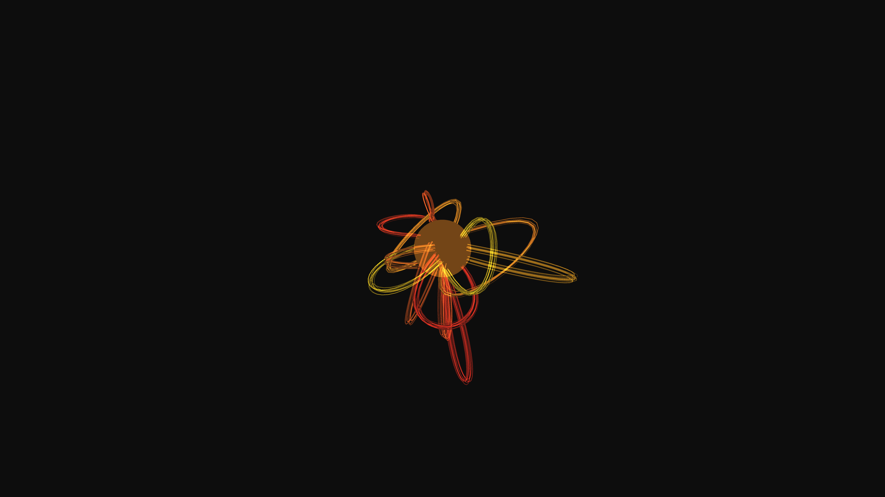

# generative_magnetic_flux_tubes_3d

## Metadata
- **Date**: 2026-06-20
- **Theme**: Simulating solar magnetic flux tubes twisting and erupting from a central sphere
- **Technique**: Using 3D bezier curves driven by sine-wave offsets to create thick, glowing ribbons of plasma erupting from and returning to a central glowing sphere. Multiple offset curves per tube create a voluminous, energetic plasma look with additive blending.
- **Logic Lab Reference**: 

## Concept
Simulating solar magnetic flux tubes twisting and erupting from a central sphere.

## Technical Details
- **Renderer**: Unknown
- **Simulation**: Unknown
- **Visuals**: Unknown
- **Animation**: Contains animation details
