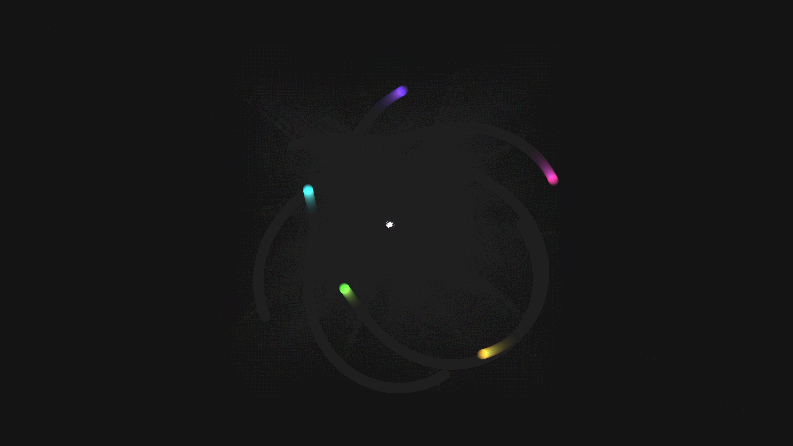

# generative_magnetic_pendulum_fractals_2d

## Metadata
- **Date**: 2026-06-27
- **Theme**: A kinetic simulation of thousands of pendulums moving under the influence of gravity and multiple ma
- **Technique**: Unknown
- **Logic Lab Reference**: 

## Concept
A kinetic simulation of thousands of pendulums moving under the influence of gravity and multiple magnetic points. Over time, the pendulums' trajectories trace out their fractal basins of attraction. The rendering uses additive blending on faint, fading trails to reveal the glowing, symmetrical patterns formed by chaotic motion.

## Technical Details
- **Renderer**: Unknown
- **Simulation**: Unknown
- **Visuals**: Unknown
- **Animation**: 
