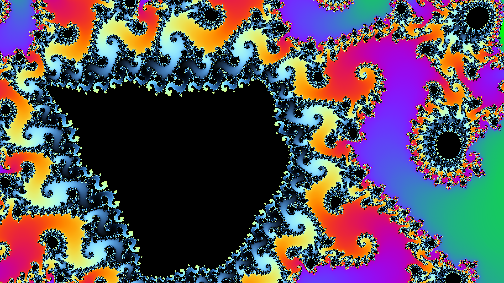

# generative_mandelbrot_deep_zoom_2d

## Metadata
- **Date**: 2026-06-28
- **Theme**: An incredibly deep, continuous zoom into a highly complex region of the Mandelbrot Set (known as the
- **Technique**: Evaluating the Mandelbrot fractal formula $Z = Z^2 + C$ at this level of magnification requires huge precision. Thankfully, NumPy uses double-precision (`float64`) by default, which allows us to zoom in by a factor of up to $10^{13}$ without suffering from floating-point pixelation. To ensure a beautiful render without visible banding, the escape velocities are mapped using a continuous, fractional logarithm smoothing technique (`iteration + 1 - ln(ln(|Z|)) / ln(2)`).
- **Logic Lab Reference**: 

## Concept
An incredibly deep, continuous zoom into a highly complex region of the Mandelbrot Set (known as the Seahorse Valley). Over the course of 15 seconds, the camera accelerates exponentially, ultimately zooming in by a magnification factor of 100,000,000,000x ($10^{11}$)!

## Technical Details
- **Renderer**: Unknown
- **Simulation**: Unknown
- **Visuals**: Unknown
- **Animation**: Contains animation details
