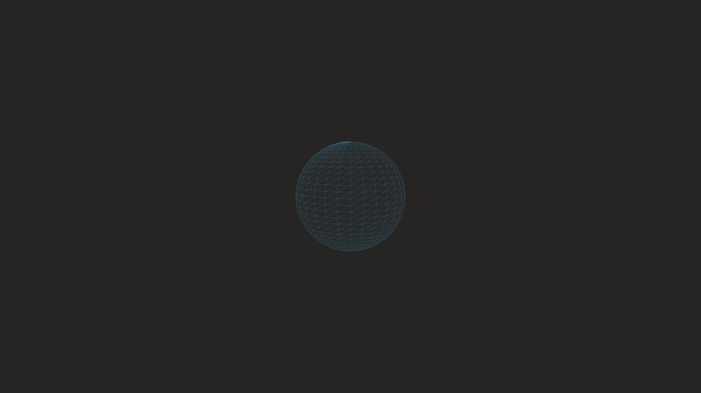

# generative_mitophagy_organelle_degradation_3d

## Metadata
- **Date**: 2026-06-20
- **Theme**: A 3D representation of mitophagy (autophagy of mitochondrion, GO:0000422)
- **Technique**: A 3D particle system where a central structured pill-cluster (mitochondrion) is slowly dissolved into independent boids that swarm outward over time, constrained by a translucent outer sphere (vacuole). The particles change color from mitochondrial orange to digested green as they break down.
- **Logic Lab Reference**: 

## Concept
A 3D representation of mitophagy (autophagy of mitochondrion, GO:0000422). Large, complex mitochondrial structures are encapsulated and broken down into simple elemental particles by a surrounding autophagosome membrane.

## Technical Details
- **Renderer**: Unknown
- **Simulation**: Unknown
- **Visuals**: Unknown
- **Animation**: Contains animation details
