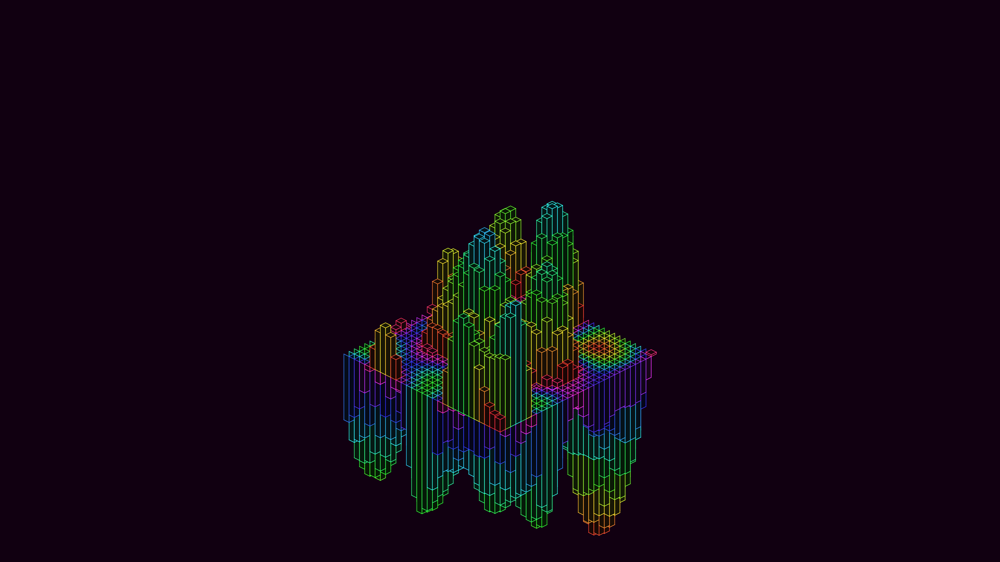

# generative_neon_wave_cityscape_3d

## Metadata
- **Date**: 2026-06-27
- **Theme**: An animated sequence of generative neon wave cityscape in 2D isometric projection
- **Technique**: Unknown
- **Logic Lab Reference**: 

## Concept
An animated sequence of generative neon wave cityscape in 2D isometric projection.

- **Theme**: A futuristic neon cityscape made of abstract glowing monoliths that undulate in waves, driven by an invisible force field.
- **Technique**: A pseudo-3D isometric scene. A grid of tall boxes is rendered using 2D polygons. The height of each box is determined by a 2D OpenSimplex noise field that shifts over time. The boxes have brightly colored neon strokes and dark faces.
- **Format**: Animation (15s @ 60fps)

## Technical Details
- **Renderer**: Unknown
- **Simulation**: Unknown
- **Visuals**: Unknown
- **Animation**: Contains animation details
