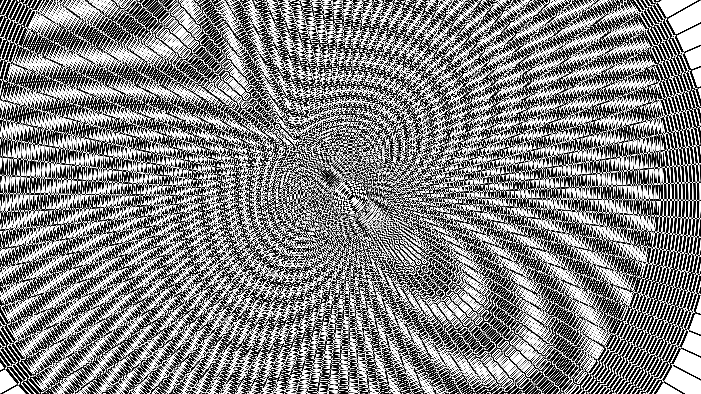

# generative_op_art_interference_patterns_2d

## Metadata
- **Date**: 2026-06-15
- **Theme**: An animated 15s sequence of high-contrast black and white optical art, featuring moving concentric s
- **Technique**: A base layer of thick concentric circles is drawn statically. A second layer of matching concentric circles is drawn over it, offset by slow-moving sine and cosine waves based on time. `py5.DIFFERENCE` blend mode is used, meaning overlapping white lines invert the underlying black lines, creating a harsh, high-contrast strobing moiré effect. A rotating starburst of radial lines is added to maximize the optical illusion.
- **Logic Lab Reference**: 

## Concept
An animated 15s sequence of high-contrast black and white optical art, featuring moving concentric shapes that create moiré and interference patterns.

## Technical Details
- **Renderer**: Unknown
- **Simulation**: Unknown
- **Visuals**: Unknown
- **Animation**: Unknown
