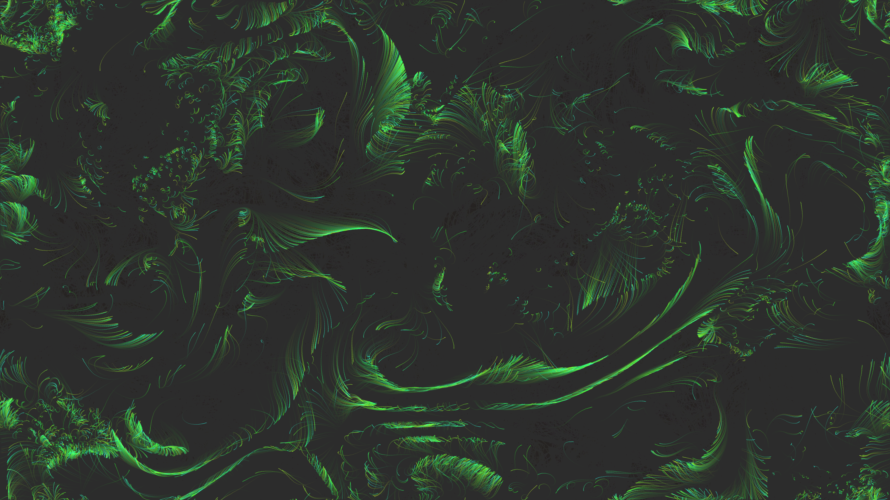

# generative_optical_flow_particles_2d

An animated sequence of thousands of semi-transparent neon particles flowing across the screen driven by a 2D vector field based on Simplex noise, creating a fluid dynamic optical flow effect.

- **Theme**: Thousands of semi-transparent neon particles flowing across the screen driven by a 2D vector field based on Simplex noise, creating a fluid dynamic optical flow effect.
- **Technique**: Generates a 2D vector field using `py5.os_noise` to govern the velocity and trajectory of thousands of point particles. A motion blur effect is created by drawing a low-opacity rectangle over the frame rather than clearing the background.

