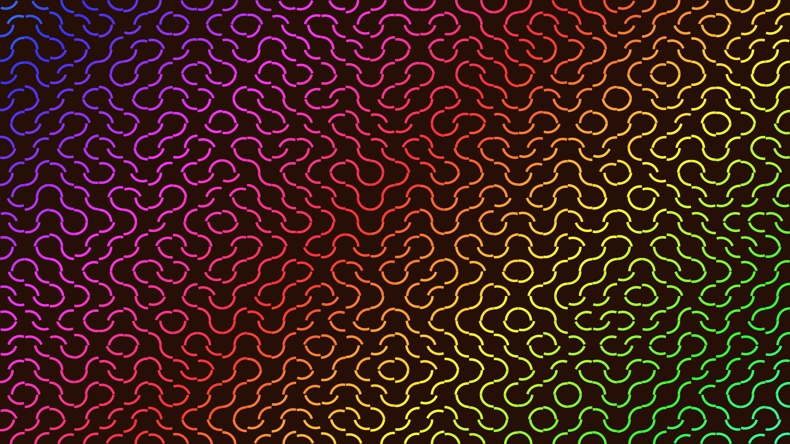

# generative_optical_illusion_truchet_tiles_2d

## Metadata
- **Date**: 2026-06-27
- **Theme**: Generative Art
- **Technique**: Utilizes a classic Truchet tiling system where each cell contains two diagonal arcs. However, instead of being statically randomized, the rotation of each tile is mapped to a 3D OpenSimplex noise field moving through time. This causes the tiles to smoothly animate between 90-degree orientations, continually redrawing the maze in an undulating wave of glowing colors.
- **Logic Lab Reference**: 

## Concept
No concept description provided.

## Technical Details
- **Renderer**: Unknown
- **Simulation**: Unknown
- **Visuals**: Unknown
- **Animation**: Unknown
